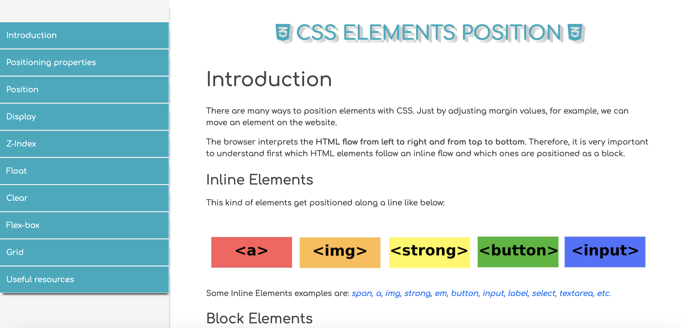

# Tecnical documentation page - CSS positoning

- [Overview](#overview)
- [The challenge](#the-challenge)
- [Links](#links)
- [Built with](#built-with)
- [What I learned](#what-i-learned)
- [Author](#author)

## Overview

## The challenge

This is one of the final projects of the Responsive Web Design course from [FreeCodeCamp](https://www.freecodecamp.org/learn)
In order to built this project, I previously learnt:

* HTML5
* CSS
* Visual Design
* Accessibility
* Responsive Design

### Links

- Solution [here](https://css-technical-documentation.netlify.app/)

### Built with

- Semantic HTML5 markup
- CSS 
- Bootstrap
- Mobile-first workflow

### What I learned

This project is ideal if you want to get a deeper understanding of CSS positioning: what are the differences between inline and block elements? Why are there so many ways of positioning an element with CSS?
On the one hand, reading, summarizing concepts and trying to explain them in an article help finding the lack in your knowledge. On the other hand, building a website is the best way to put in practise and apply all previous concepts.
Apart from this project, I have written an article more focused on flex and grid positioning. Check it out [here](https://www.cristina-padilla.com/csspositioning.html) to get some inspiration and websites/games to help you practise.

## Author

- Website - [www.cristina-padilla.com](https://www.cristina-padilla.com)
- Twitter - [@crispitipina](https://www.twitter.com/crispitipina)
